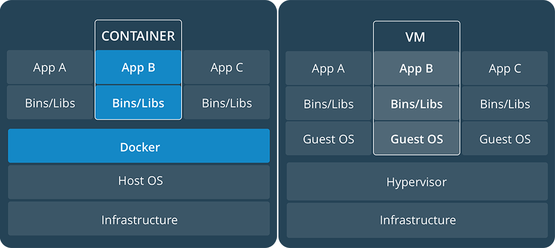

# 玩转Docker


## Docker简介
* 由<https://www.docker.com>主导开发，托管于[GitHub](https://github.com/docker/docker)
* Go语言编写
* Docker提供了一种打包、输送、运行任意应用的容器解决方案
* Docker可以让开发者打包他们的应用以及依赖包，到一个轻量级、可移植的容器中，然后发布到任何装有Docker的电脑上（windows或Linux）上
* 容器是完全使用沙箱机制，相互之间不会有任何接口（类似iPhone的app），更重要的是容器性能开销极低
* 适用于Linux平台，也支持Mac、Windows平台
* 简单易用，用于开发、测试、运维

### 容器(Docker)与虚拟机异同


[官方解释](https://www.docker.com/what-container)
* 容器和虚拟机都有隔离、分配资源的优点，但是具体功能不同。因为容器虚拟化了操作系统而非硬件，容器容易移植并且高效
* 容器抽象了应用层面的打包的代码和依赖。不同容器可以运行在同一台机器，与其他容器共享OS内核，各自运行在隔离的用户进程。容器比虚拟机占用更少的空间（容器镜像一般只有十几MB大小），并且几乎可以立即启动
* 虚拟机是物理硬件的抽象，把一台服务器虚拟成多台服务器。Hypervisor（虚拟机管理系统）允许多个虚拟机运行在一台机器，每个虚拟机包含一个完整的操作系统拷贝，一个或多个应用，必要的程序和库，至少占用若干个GB的空间。虚拟机通常启动非常慢

[中文资料]()
* 都是虚拟化技术，Docker可以解决所有虚拟机的问题，如虚拟机耗费太多的资源
* 虚拟机擅长彻底隔离整个运行环境，Hypervisor为每个APP启动一个GuestOS（虚拟机），是对硬件资源虚拟化
* 容器用于隔离不同的应用，直接使用硬件资源，效率更高、消耗资源更少，例如微服务

> 可以对比云端数据隔离三种方案，独立数据库/同库不同Schema/同库同Schema以字段TenantID隔离（[SaaS多租户数据隔离方案](https://blog.csdn.net/yown/article/details/51288549)）

```
APP - ENV(LIBS) - DOCKER - OS - HARDWARE
WAR - TOMCAT + JVM - DOCKER - LINUX - PC
```

### 为什么使用Docker
* 更快速的交付和部署。开发时创建并配置好镜像（包含应用和各种依赖），然后这个镜像可以在任意安装Docker的机器运行。而且Docker容器很轻量很快，启动是即时的，大量的节约开发、测试、部署的时间
* 更轻松的迁移和扩展，几乎可以在任意平台之间迁移，不用关心底层系统和硬件
* 更高的资源利用率。一台主机上可以同时运行数千个Docker容器，容器除了运行其中的应用外，基本不消耗额外系统资源。比如一台PC上运行10个Docker容器和10个虚拟机
* Docker的想法是创建软件程序可移植的轻量级容器，让其在任何安装了Docker的机器上运行，而不关心底层操作系统，犹如集装箱不关心何种船舶

**Docker的目标是简化部署流程，提高生产力**

### Docker基本概念
* **镜像（Image）**，只读的模板。包含一个完整的OS环境，安装了应用或其他应用。镜像用来创建一个或多个Docker容器，或者直接从其他地方下载一个做好的镜像来使用
* **容器（Container）**，用来运行应用。他是从镜像解压出来的运行实例，可以被开始、停止、删除，每个容器都是相互隔离的，保证平台的安全。可以把容器看作一个简易版的Linux环境（包括root用户权限、进程空间，用户空间和网络空间等）和运行在其中的应用程序及其依赖。文件系统隔离技术使得Docker成为了一个非常有潜力的虚拟化技术，在容器中对文件进行修改、删除、创建
* **仓库（Registry）**，集中存放镜像文件的场所，类似于NPM或者GitHub的托管服务。一般不严格区分仓库和仓库注册服务器（Registry），仓库注册服务器往往存放着多个仓库，每个仓库又包含了多个镜像。仓库分为Public和Private两种，最大的公开库是Docker Hub，存放了数量庞大的镜像供用户下载，国内有阿里云、网易云等，访问相对快速。当然用户也可以在本地创建一个私有仓库。当用户创建了自己的景象，就可以使用`push`命令将它上传到公有云或者私有仓库，这样其他机器就可以使用这个镜像，只需从仓库`pull`下来就可以了。

## Windows下安装Docker

### 系统要求
* 64位操作系统
* Windows10 10586以上版本内置了Hyper-V，只需开启就可以直接安装Docker
* Windows10 10586以下版本需要下载安装[Docker Toolbox](https://docs.docker.com/toolbox/overview/#whats-in-the-box)（VirtualBox），再安装Docker

### 下载地址
* [Docker Stable](https://download.docker.com/win/stable/Docker%20for%20Windows%20Installer.exe)
* [Docker Toolbox](https://download.docker.com/win/stable/DockerToolbox.exe)

## 简单使用Docker
* 打开CMD.exe
* 尝试如下命令
```
docker info # 查看Docker信息
docker version # 查看Docker版本

docker run hello-world # 先查看本地有没有，没有会执行 docker pull hello-world
```
* 一般将Docker切换到Linux环境下
* 可以使用国内Docker镜像以加快下载速度，通过`docker info`查看

## 操作镜像
* 获取镜像，[Docker Hub](https://hub.docker.com/explore/)
```
docker pull [OPTIONS] NAME[:VER]

docker pull trainig/webapp:latest
docker pull registry.xxx.com/yyy/IMAGE:1.0
```
* 列出本地镜像
```
docker image ls
docker images
-
REPOSITORY  TAG IMAGE_ID CREATED  SIZE
```
* 镜像默认存放位置
1. Linux: /var/lib/docker下的overlay或overlay2或btrfs或devicemapper或zfs等目录（依赖系统内核）
2. Windows: Windows存放在Hyper-v中或Toolbox开启的虚拟机中（LinuxKit），Hyper-v的位置为C:\Users\Public\Documents\Hyper-v\...vhdx
* 删除本地镜像
```
docker image rm NAME|IMAGE_ID
```

## Docker容器操作
* 查看容器
```
docker ps   # 查看启动的容器
docker ps -a    # 查看所有容器（启动和未启动）
```

* 新建并启动容器
```
docker run [OPTIONS] IMAGE [COMMAND] [ARG...]

OPTIONS:
    -d: deamon方式运行（后台运行）
    -t: 让Docker分配一个伪终端（Shell），并绑定到容器的标准输入上
    -i: 让容器标准输入与伪终端保持连接，并始终打开（否则看不到回显）
    -v: 创建数据卷
    -p: 映射端口（本地端口:容器内端口）
    --name: 为容器命令
```
示例:
```
# 注意参数在前
# 启动镜像作为后台服务并映射端口
docker run -d -p 8888:5000 IMAGE_ID|IMAGE_NAME

# 同上，启动伪终端
docker run -idt -p 8888:5000 MAGE_ID|IMAGE_NAME /bin/bash
```

* 启动 | 重启 | 终止 | 删除容器
```
docker stop [OPTIONS] CONTAINER [CONTAINER...]
docker start [OPTIONS] CONTAINER [CONTAINER...]
docker restart [OPTIONS] CONTAINER [CONTAINER...]
docker rm [OPTIONS] CONTAINER [CONTAINER...]
```

* 进入容器（获取Shell）
```
docker exec [OPTIONS] CONTAINER COMMAND [ARG...]

docker exec -i -t CONTAINER /bin/bash
```

* 本地主机和容器间相互拷贝数据
```
docker cp SRC DEST

# 容器内文件 -> 本地主机
docker cp CONTAINER:/opt/www/app.js D:/www/
# 本地主机文件 -> 容器
docker cp D:/www/app.js CONTAINER:/opt/www/
```

* 数据卷，共享本地主机的目录（实时双向映射）
> 需要设置Settings -> Share Drivers，勾选盘符并重启Docker
```
docker run -v LOCAL_FOLDER:CONTAINER_FOLDER
docker run -v C:/www:/opt/www/ CONTAINER
```

* 一个例子
```
docker run -itd -p 80:80 -p 3306:3306 lamp --privileged=true -v C:/data/www:/user/www registry.xxx.com/yyy/lamp:v2 /usr/sbin/init

# 映射端口
# 启动一个伪终端，并获取管理员权限
# 数据卷映射
```

## 制作镜像并推送到线上仓库

1. 获取镜像，解压并运行为容器
2. 修改容器内容，成为新的容器
3. 压缩容器，成为新的镜像
4. 将镜像上传到仓库（Registry）

```
# 启动运行一个容器，并进入容器
docker run -i -t --name NEW-CONTAINER-NAME /bin/bash
# 修改 安装等等操作

# 转换容器为镜像（类似于Git中的commit，镜像提交到本地仓库）
docker commit -a "AUTHOR" -m "DESCRIPTION" CONTAINER_ID NAME:VER

# 登录到Docker仓库（DockerHub或其他第三方仓库）
docker login --username=USERNAME registry.xxx.com
# 输入密码

# 为镜像命名（打标签）
docker tag IMAGE_ID registry.xxx.com/yyy/NAME:VER

# 推送到线上仓库
docker push registry.xxx.com/yyy/NAME:VER
```

## 本地镜像导出和加载（离线操作）
* 导出镜像到本地
```
docke save -o DEST_FILE SRC_IMAGE

docker save -o D:/www/NAME-ver.tar IMAGE
```
* 加载镜像

> 可以用ssh工具将文件传输到其他机器

```
# 必须是压缩格式为tar的文件 "<"和"-i"等效
docker load < FILE.tar

docker load -i D:/www/NAME-ver.tar
docker images
```

## Dockerfile

> Docker的目标是帮助开发和运维人员更容易的跨系统跨主机交付应用程序和他们的依赖。**Dockerfile**是由一系列指令和参数构成的脚本，这些指令最终目的是创建一个新的镜像，它简化了从头到尾的流程和部署工作。刚才制作镜像（`docker commit`）的过程中，需要修改、安装等操作以及若干命令，Dockerfile就是来存放这些操作的脚本。Dockerfile有一些自己的的语法和命令，来描述整个构建过程，以及指定**镜像的启动参数**

Dockerfile包含一条条指令（Instruction），**每一条指令构建一层**，所以每一层指令执行结束等会commit这一层的修改，构成新的镜像，所以尽量限制层数

### 构建镜像

```
docker build [选项] <上下文路径/URL/->

# -t (-tag)，命名
# . 代表上下文
docker build -t my-image:v2 .
docker build https://github.com/xx/yy.git#:8.14 # 用Git repo进行构建，自动clone项目、切换分支、进入指定目录开始构建
docker build http://server/context.tar.gz # 下载解压并作为上下文开始构建
docker build - < Dockerfile # 从标准输入中读取Dockerfile
cat Dockerfile > docker build - # 从标准输入中读取Dockerfile
docker build - < ctx.tar.gz # gzip/bzip2/xz会被自动解压展开，视作上下文开发构建
```

> `docker`命令属于客户端工具，Docker还会运行一个Docker引擎（服务端守护进程，提供一组REST API）。所以`docker`客户端工具都是通过这组API和Docker引擎交互（Docker引擎是真正干活的），来完成各种功能。所以表面上看是在本地执行各种`docker`功能，实际上都是通过远程调用完成（C/S设计），所以操作远程服务器的Docker变得很容易。所以`docker build`指定上下文路径后，会打包上传给Docker引擎，Docker引擎会展开并构建镜像。所以类似`COPY`命令，实际上是在拷贝上下文中的文件，而非上下文外的文件。

### Dockerfile语法

语法示例

```
# 这一行是注释
COMMAND [ARGS] ... # 这一行是命令

# 例子
# Print "Hello docker!"
RUN echo "Hello docker!"
```

### Dockerfile指令

* FROM，指定基础镜像

> [Docker Store](https://store.docker.com/)有很多高质量的官方镜像，服务镜像如nginx、redis、tomcat等，语言镜像如node、python、golang等，基础操作系统镜像如ubuntu、debian、alphine等，还有一个特殊镜像scratch（空白镜像），特别适合不以系统为基础，所需一切库都在可执行文件里的应用，因此`FROM scratch`会让镜像体积更小，特别适合**Go**语言

```
FROM [IMAGE]

FROM scratch
# ...
```

* RUN，执行命令行命令

两种格式：
1. shell格式， `RUN [命令]`
2. exec格式，`RUN ["可执行文件", "参数1", "参数2"]`

```
# 这个例子会创建多层镜像，很多运行时不需要的东西会被装进镜像，不推荐
RUN buildDeps='gcc libc6-dev make'
RUN apt-get update
RUN ...

# 推荐方式，将多行整理成一行
RUN buildDeps='gcc libc6-dev make' \
    && apt-get update
    && apt-get install -y $buildDeps \
    && wget -O redis.tar.gz "http://download.redis.io/releases/redis-3.2.5.tar.gz" \
    && mkdir -p /usr/src/redis \
    && tar -xzf redis.tar.gz -C /usr/src/redis --strip-components=1 \
    && make -C /usr/src/redis \
    && make -C /usr/src/redis install \
    && rm -rf /var/lib/apt/lists/* \
    && rm -rf redis.tar.gz \
    && rm -r /usr/src/redis \
    && apt-get purge -y --auto-remove $buildDeps

# 每行末尾的 "\" 是命令换行符
# 指令末尾有删除和清理工作，这是非常非常好的实践，不然制作出来的镜像非常臃肿
```

* COPY, 从**上下文目录**中\<SRC\>复制文件到新的一层的镜像内位置\<DEST\>
```
COPY <SRC> <DEST>

# <SRC>可以使用通配符（Go的filepath.Match）
COPY hom?.txt /mydir/
```

> Go语言的 [filepath.Match](https://golang.org/pkg/path/filepath/#Match)

* ADD, 增强的`COPY`命令（官方建议使用COPY，语义更明确）
1. \<SRC\>可以是URL，会尝试自动下载并拷贝到\<DEST\>目录下
2. \<SRC\>如果是gzip/bzip2/xz压缩文件, 会自动解压到\<DEST\>目录下
```
ADD <SRC> <DEST>

# 解压到/目录下
ADD ubuntu-core.tar.gz /
```

> 最佳实践：文件复制均使用`COPY`，仅在需要自动解压缩的场合使用`ADD`

* CMD，指定容器主进程启动命令

Docker不是虚拟机，容器就是进程。既然是进程，那么在启动容器的时候，需要指定内部主程序的参数。`CMD`就是指定**默认主进程的启动命令的**。启动容器就是启动主进程。

镜像`ubuntu`的默认`CMD`是`/bin/bash`，所以`docker run -it ubuntu`执行后会直接进入`bash`，当然也可以指定别的命令，如`docker run -it ubuntu cat /etc/os-release`，打印系统版本信息。一般推荐使用`exec`格式

和`RUN`相似，`CMD`也是两种格式
1. shell格式， `CMD [命令]`
2. exec格式，`CMD ["可执行文件", "参数1", "参数2"]`
3. 参数列表格式，`CMD ["参数1", "参数2"]`。在指定了`ENTRYPOINT`指令后，用`CMD`指定具体的参数

```
# 以下两行等效
CMD echo $HOME
CMD ["sh", "-c", "echo $HOME"]

# 以下命令执行后立即退出
CMD service nginx start
```

容器中没有后台服务的概念，容器就是为内部的主进程而存在的，主进程退出，容器就失去了存在的意义，从而退出，不能以传统的虚拟机理解容器。所以容器中没有所谓的`后台`，都是以`前台`方式运行的。比如刚才的`CMD service nginx start`会被转换成`CMD ["sh", "-c", "service nginx start"]`执行，那么`sh`就是主进程，`service nginx start`结束后，`sh`就执行结束并退出了，容器自然就退出了。正确的做法是让nginx以`前台`形式运行：

```
CMD ["nginx", "-g", "daemon off;"]
```

* ENTRYPOINT，入口点

`ENTRYPOINT`的目的和`CMD`命令一样，都是指定容器启动程序和参数。`ENTRYPOINT`在运行时也可以被替代，`docker run xx --entrypoint`来指定

和`RUN`指令格式一样，有`shell`和`exec`两种格式，略。那么通过两个场景来区别`CMD`区别：

1. `docker run IMAGE [CMD]`，`[CMD]`会直接替换`Dockerfile`中的`CMD`，而`[CMD]`可以追加到`ENTRYPOINT`后面作为参数

```
# Dockerfile
FROM ubuntu:latest
CMD ["curl", "-s", "http://ip.cn"]

# 构建镜像
docker build myip .
# 启动容器，报错无法启动，executable file not found
docker run myip -i

# "-i" 会直接替换'CMD ["curl", "-s", "http://ip.cn"]'，而"-i"不是可执行命令
# 所以将Dockerfile中CMD改为ENTRYPOINT
...
ENTRYPOINT ["curl", "-s", "http://ip.cn"]
# 启动容器运行成功，因为 "-i" 被作为参数传递给 curl
```

2. 将`CMD`作为参数传入`ENTRYPOINT`，一般用来作为应用运行前的准备工作
```
# 最终"yyy"会被作为参数传入"x.sh"中
ENTRYPOINT ["x.sh"]
CMD ["yyy"]
```

* ENV，环境变量设置

> docker容器里也可以访问到

```
ENV <key> <value>
ENV <key1>=<value1> <key1>=<value1>

ENV VERSION=1.0 DEBUG=on \
    NAME="Tom"
RUN curl -S "https://xxx.com/$VERSION/api"
```

这些指令支持环境变量展开：
`ADD` `COPY` `ENV` `EXPOSE` `LABEL` `USER` `WORKDIR` `VOLUME` `STOPSIGNAL` `ONBUILD`

* ARG，构建参数

和`ENV`一样都是构建环境变量，但`ARG`设置的环境变量，是不会在容器里存在的。

```
# <默认值>可以被"docker build --build-arg <参数名>=<值>"覆盖
ARG <参数名>[=<默认值>]
```

* VOLUME，定义匿名卷

容器运行时应尽量保持容器存储层不发生写操作，对于数据库类需要保存动态数据的应用，数据文件应该保存于卷中，如果运行时忘记制定某些目录为卷，会默认写入`Dockerfile`中指定的匿名卷。

> 最佳实践：不写数据到容器存储层，保持容器无状态化

```
VOLUME <路径>
VOLUME <路径1> <路径2>...

# 运行时自动挂载为匿名卷，所有向`/data`目录写入的数据都不会记录到容器存储层
VOLUME /data

# 替换匿名卷
docker run -v LOCAL_PATH:CONTAINER_DATA_PATH xxx
```

* EXPOSE，声明端口

声明运行时容器提供服务端口，这只是一个声明，运行时不会因为这个声明，应用就会开启这个端口的服务。主要是两个用途，帮助镜像使用者理解镜像服务的守护端口，方便配置映射；还有一个用处就是运行时，及`docker run -p <端口>`时，会自动随机映射`EXPOSE`声明的端口

```
EXPOSE <端口1> [<端口2>...]
```

* WORKDIR，指定工作目录

指定工作目录（当前目录），作为之后每一层指令的工作目录，如果不存在，`WORKDIR`会自动创建

```
WORKDIR <工作目录路径>
```

例子：
```
RUN cd /app
RUN echo "hello" > word.txt
```
运行之后的镜像中无法找到`/app/word.txt`，因为每一层指令都是单独的一层，第一层的容器中`cd`并不会带到第二层，因为是第二层启动的是全新的容器，已经和第一层没关系。这时应该用`WORKDIR`来指定工作目录

* USER，指定当前用户

和`WORKDIR`类似，都是改变环境状态并影响以后的层，`WORKDIR`是改变工作目录，`USER`则是改变之后层的执行`RUN`、`CMD`以及`ENTRYPOINT`这类命令的身份。当前前提是这个用户是已经建立好的，否则也无法切换

```
USER <用户名>

# 先建立一个用户
RUN groupadd -r redis && useradd -r -g redis redis
USER redis
RUN [ "redis-server" ]
```

* HEALTHCHECK，健康检查

> Docker 1.12新引入的指令

```
# 设置检查容器健康状况的命令
HEALTHCHECK [选项] CMD <命令>
# 如果基础镜像有健康检查指令，使用这一行可以屏蔽之
HEALTHCHECK NONE
```

容器启动后，初始状态为`starting`，在`HEALTHCHECK`指令检查成功后变为`healthy`，如果满足失败条件，则会变为`unhealthy`

`HEALTHCHECK`支持下列选项：

1. `--interval=<间隔>`：两次健康检查的间隔，默认为30秒
2. `--timeout=<时长>`：健康检查的超时时间，超过这个时间视为本次检查失败，默认30秒
3. `--retries=<次数>`：连续失败的指定次数，达到了则视为`unhealthy`，默认3次

```
FROM nginx
RUN apt-get update \
    && apt-get install -y curl \
    && rm -rf /var/lib/apt/lists/*
HEALTHCHECK --invervals=5s --timeout=3s --retries=2 \
    CMD curl -fs http://localhost/api || exit 1
```

容器内启动了一个webserver，并暴露`http://localhost/api`接口，每5秒访问一次，每次超过3s视为失败，允许失败2次，超过了就退出主进程，终止容器运行

* ONBUILD，为定制镜像而准备的

```
ONBUILD <其他指令>
```

`ONBUILD`在构建当前镜像不会被执行，而是在以当前镜像为基础镜像，去构建下一级镜像的时候才会被执行。类似于继承的概念，把公共部分提取到上层，供下层直接使用

```
# 基础镜像，构建时 ONBUILD 不会被执行
FROM node:slim
RUN mkdir /app
WORKDIR /app
ONBUILD COPY ./package.json /app
ONBUILD RUN ["npm", "install"]
ONBUILD COPY . /app/
CMD ["npm", "start"]

# 项目（APP）镜像，基础镜像中的 ONBUILD 会被执行
FROM my-node
```

## Linux下Docker管理

```
# 打印当前系统名称、版本
> uname -a

# 重启docker服务
systemctl restart docker
/etc/init.d/docker restart
service docker restart
```

