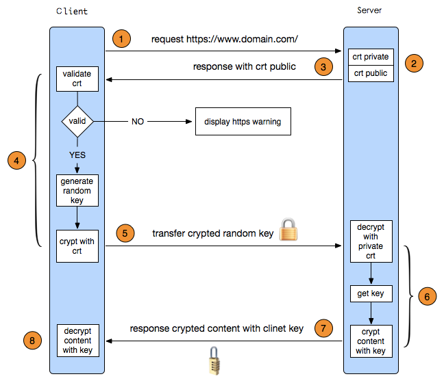
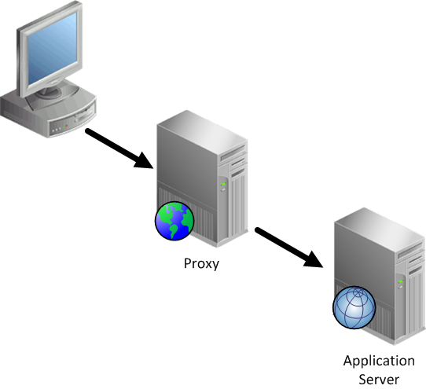

# KT - TC Proxy & SLD CONN & Addon

## Agenda

### TC Proxy
* HTTPS (curl & wireshark)
* HTTPS in Java (Keystore and Truststore)
* Proxy 

### SLD Connection
* Requirements (To Get meta of addons)
* Design (Auth/Cookie/API call)
* API of SLD Extension Manager

### Service Layer Servlet
* /tcli/sl/* (Access all SL API)

## Addon Development


## TC Proxy

### HTTPS

* HTTP over SSL/TLS (Security Socket Layer/Transport Layer Security) 由网景公司开发，现在由IETF维护 (SSL 3.0 -> TLS 1.0 -> TLS 1.1 -> TLS 1.2)

### 几个术语
* CA证书: 颁发者 | 使用者 | 版本 | 签名Hash算法 | 使用者 | **公钥**等等
* 非对称加密算法(密钥交换算法), 公钥和密钥两者相互解密，密钥不公开, 用于握手时的认证. 主要包括RSA, ECDH, PSK等算法
* 对称加密算法, 加密数据. 主要包括DEC56/56, AES 128/128, AES256/256等, 数字表示密钥长度
* Hash算法(报文认证信息码MAC算法), 创建报文摘要,确保消息没有被篡改, 主要包括MD5, SHA等
* PRF (Pseudo Random Function), 用于生成Master Secret



### HTTPS in Java

* KeyStore & TrustStore

> TrustManager: Determines whether the remote authentication credentials (and thus the connection) should be trusted.

> KeyManager: Determines which authentication credentials to send to the remote host.

* `openssl`
```
// Print a public key
openssl s_client -connect {HOST:PORT} | openssl x509 -pubkey -noout
```

* `keystool`
```
// Import a public 
keytool -import -file C:\mycert.cert -alias mycert -keystore myTrustStore.jts

// Useful commands
keytool -list -v -keystore *.jks [-alias aliasName]
keytool -delete -alias aliasName -keystore *.jks -storepass password
keytool -export -keystore aliasName -alias signFiles -file Example.cer
keytool -printcert -file example.cer
```

* Code

### Proxy

一个网络终端（一般为客户端）通过这个服务与另一个网络终端（一般为服务器）进行非直接的连接



## SLD Connection

主要为Addon服务，从B1 Extension Manager获取Extension的Meta信息，包括Addon的名称、注册地址等等

### Code

在`//BUSMB_B1/SBO_TEMP_PRJ/INNOVATION_WORK/ThinClientWave21/java/main/extn/src/main/java/com/sap/b1/thin/extn/`目录下：

* SLDConnection.java
* SLDConnectionConfig.java
* SLDExtensionMeta.java
* SLDHttpMethod.java
* SLDHttpResponse.java

使用工厂模式，只有一次登录

使用：

```
SLDConnection sldConn = SLDConnection.custom().setMethod(SLDHttpMethod.GET).setServiceName(serviceName)
				.setQueryParams(queryParams).build();
		sldResponse = sldConn.execute();
```

## Service Layer Servlet

ThinClient作为Proxy代理用户访问Service Layer的Rest API

### Code

`//BUSMB_B1/SBO_TEMP_PRJ/INNOVATION_WORK/ThinClientWave21/java/main/infra/tcli/src/main/java/com/sap/b1/servlets/service/ServiceLayerServlet.java`

## Addon Development

Refer to [ThinClient Addon Development](https://jam4.sapjam.com/groups/39ZtzFUkVJd9OQA7NM8kmK/content?folder_id=cRTOYpvHuZenrngmHanfZs)

## UIAPI Documentation tool

解析UIAPI framework代码中的注释，并自动生成文档

`//BUSMB_B1/SBO_TEMP_PRJ/INNOVATION_WORK/ThinClientWave21/node/build/task_doc.js`