# 揭开Vertical-Align的所有秘密

> <http://christopheraue.net/design/vertical-align>

Vertical-align主要用来对齐相邻的文本和元素。也可以在一些场景下更灵活、细粒度的控制对齐。元素大小不必事先知道，在同一个文档流中，改变vertical-align会影响流中其他元素，这一点常用来对齐文本旁边的小图标。

## Vertical-align的特点
Vertical-Align有时很操蛋，经常不按预想的方式工作，让人摸不清规律。比如修改当前元素的Vertical-align，没有任何效果，但其他元素却受到影响，说多了都是泪。

更糟的是大部分资料都讲的很浅，尤其是布局的时候使用Vertical-align，这些资料可能造成误导，让你以为Vertical-algin可以垂直对齐元素内部所有东西。又或者只简单介绍基本属性，和几个非常简单的使用场景，却不深究为什么。

所以我暗暗定了一个小目标：彻底搞清楚Vertical-align。我查看W3C的CSS相关规范，写了一些例子，最终才有了这篇文章。

下面我们先看看游戏规则。

## 使用Vertical-Align的条件

vertical-align常用来对齐[inline-level元素](http://www.w3.org/TR/CSS2/visuren.html#inline-level)（内联元素/行内元素），也就是当元素的display被设置为如下值的时候：
* inline
* inline-block
* inline-table (本文暂不讨论)

**inline元素**基本都用来包装文本

**inline-block元素**如名所示：兼具inline和block的特征的元素。他们可以设置宽、高（或者由内容决定宽高），padding、border和margin。

inline元素挨个排在同一行，一旦排满整行会另起新行。每行会产生一个所谓的“行盒子”，围着整行内容的盒子。内容大小不同造成“行盒子”的高度不同。下图展示了一些“行盒子”，红色虚线代表每行高度的上下边界：

图-1

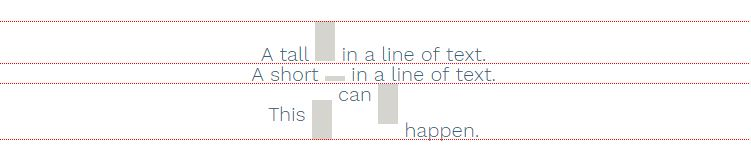

上图展示了我们即将探讨的大致范围，这些“行盒子”内，每个单独的元素都在用vertical-align对齐，那么，这些元素到底在对齐什么？

## 关于基线（Baselines）和外边界（Outer Edges）

关于垂直对齐，最重要的一点就是相关元素的基线位置。某些情况下，元素盒子的上下边界也很重要。下面看看每种类型的元素，其基线和外边界的位置

### Inline元素

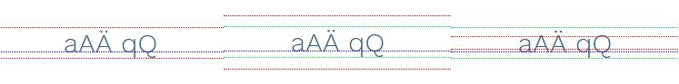

这里有三组行文字。红色虚线表示行高的上下边界，绿色表示文字上下边界，蓝色代表基线。最左边的例子中，设置了line-height与font-size相同，所以绿线和红线重叠。中间的例子，line-height是font-size的两倍。最右边的例子，line-height为font-size的一半。

```css
font-size: 1.5em;

line-height:  1; /* 左边 */
line-height:  2; /* 中间 */
line-height: .5; /* 右边 */
```

**结论**：

**inline元素的外边界**与line-height一致，即使line-height比font-size小，结果会是右边例子的红线那样。

**inline元素的基线**恰好是字符“坐”着的那条线，如蓝线所示。可以粗略的认为，基线位于文字中间偏下的某个位置。详见W3C规范中的[具体定义](http://www.w3.org/TR/CSS2/visudet.html#leading)。

### Inline-Block元素

图-3

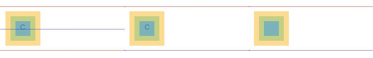

从左往右依次是：

* inline-block元素以及它[流内](http://www.w3.org/TR/CSS21/visuren.html#positioning-scheme)（in-flow）内容（"c"）
* inline-block元素`overflow:hidden`，以及流内内容
* inline-block元素没有流内内容（内容区域设置了高度）

其中红色虚线是margin边界，黄色是边框，绿色是padding，蓝色是内容，蓝色虚线是基线。

**结论**：

**inline-block元素的外边界**是[外边距盒子](http://www.w3.org/TR/CSS2/box.html#x17)（margin-box）的上下边界，如图中红色虚线所示。

**inline-block元素的基线**则依赖其元素流内内容:

* 左边inline-block元素的基线，_就是流内最终有内容的那个元素的基线_。这个最终元素的基线位置有固定规则
* 中间inline-block元素有流内内容，但overflow被设置为非visible，它的基线则是外边距盒子的下边界，也就是inline-block元素的下边界
* 右边inline-block元素没有流内内容，但它的基线就是外边距盒子的下边界

### 行盒子（Line Box)

图-4

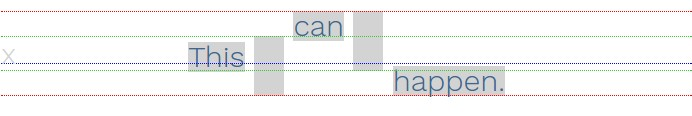

这张图前面已经展示过，但这次我给文本盒子画了上下边线（绿色），基线依旧是蓝色，我还给文本元素设置了高亮背景灰色。

行盒子的上边界，与行内最靠上元素的上边界一致；行盒子的下边界，与行内最靠下元素的下边界一致，也就是图中红色虚线的位置。

**结论**：

**行盒子的基线**是个“变量”：

> CSS 2.1没有定义行盒子的基线位置 - [W3C Specs](http://www.w3.org/TR/CSS2/visudet.html#line-height)

这部分也许就是Vertical-align中最令人困惑的。就是说，基线会被放在满足某些条件的位置，比如vertical-align和最小的行盒子高度。好像等式里的任意参数一样。

因为行盒子的基线是不可见的，所以无法直观显示它。但有个简单的方法让它“可见”，在行的一开始加个字符，比如上图我加了字符“x”。如果这个字符没设置任何的对齐，那么它默认会“坐”在基线上。

在行盒子的基线周围，有一个“文本盒子”。文本盒子可以简单的认为是，在行盒子内部没设置对齐的inline元素。它的高度等于父元素的font-size，所以文本盒子仅仅包着无格式的文字，如绿色虚线所示。所以文本盒子和基线“绑”在一起，当基线移动它会跟着动。（这种文本盒子在W3C规范中被叫做[strut](http://www.w3.org/TR/CSS2/visudet.html#strut)）

好了，这些就是最难的部分。现在，这些就是全部内容。我们对关键点做个总结：
* 有一个叫做*行盒子*的区域，它就是垂直对齐起作用的地方，它包含一个*基线*，一个*文本盒子*和*上下边界*
* *inline元素*就是那些被对齐的对象，它有*基线*和*上下边界*

## Vertical-Align的价值

如上面总结中提到的，使用vertical-align的关键点在于给出明确的作用关系。

### 对齐元素的基线，相对于行盒子基线

图-5

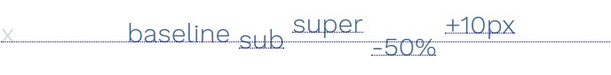

* **baseline**：元素的基线准确的”坐“在行盒子上边的基线
* **sub**：元素的基线换到了行盒子基线的下面
* **super**：元素的基线换到了行盒子基线的上面
* **\<percentage>**：元素的基线换到了相对于行盒子基线相对于line-height的百分比位置
* **\<length\>**：元素的基线换到了相对于行盒子基线一个绝对长度的位置

### 对齐元素的外边界，相对于行盒子基线

图-6

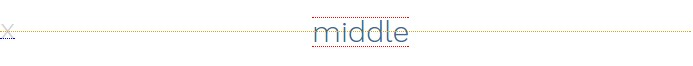

* **middle**：元素中间点，被对齐到行盒子基线+字符”x”一半的高度的位置

### 对齐元素的外边界，相对于行盒子的文本盒子

图-7

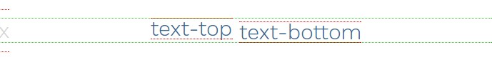

因为文本盒子的位置由基线决定，所以这两个例子相对于行盒子基线之下对齐

* **text-top**：元素的上边界，与行盒子的文本盒子的上边界对齐
* **text-bottom**：元素的下边界，与行盒子的文本和下边界对齐

### 对齐元素的外边界，相对于行盒子的外边界

图-8

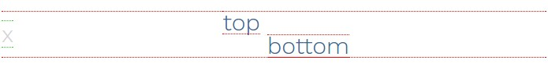

* **top**：元素的上边界，与行盒子的上边界对齐
* **bottom**：元素的下边界，与行盒子的下边界对齐

W3C的规范在[这里](http://www.w3.org/TR/CSS2/visudet.html#propdef-vertical-align)

## 为什么Vertical-Align会有这些奇怪的表现

现在我们结合具体应用场景观察垂直对齐，尤其是几个常被误用的情况

### 居中图标

常见错误：我有一个图标，想让它相对文本居中对齐，给图标设置`vertical-align: middle`，但居中效果并不理想，看下面这个例子：

图-9

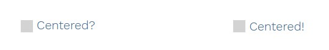

```html
<style type="text/css">
.icon { display: inline-block; /* size, color... */ }
.middle { vertical-align: middle; }
</style>

<!-- left mark-up -->
<span class="icon middle"></span>
Centered?

<!-- right mark-up -->
<span class="icon middle"></span>
<span class="middle">Centered!</span>
```

还是这个例子，我画了一些辅助线：

图-10

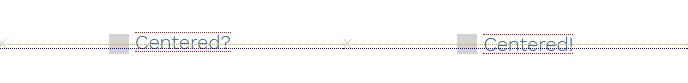

这对我们的问题有所启发。因为左边文字一点也没有对齐，它“坐”在了基线上。事实是，通过设置盒子`vertical-align: middle`，我们将其对齐到没有上升部（字母“x“高度的一半）的小写字母中间。所以有上升部的字母都突出上边界。

右边的例子，我们也让整个字体的区域，与它的垂直中点对齐。文字的基线稍稍低于行盒子的基线，结果是我们漂亮的让图标相对文本居中对齐。

### 行盒子基线的移动

这是用vertical-align时常见的一个坑：行盒子基线的位置，受行内所有元素的影响。假设一个元素这样对齐，那么行盒子的基线就会移动。因为大部分相对于基线都垂直对齐了（除了上下边界），这导致那一行所有其他元素自动调整位置。

一些例子：

* 有一个很高的元素充满整个行，vertical-align对它没有作用。因为在它的上下没有可移动的空间。为了满足相对于行盒子基线对齐，行盒子基线必须移动。较矮的盒子设置`vertical-align: baselin`。如左边例子，较高的盒子与text-bottom对齐。右边例子，与text-top对齐。可以看到基线带着短盒子跳到上边了。

图-11

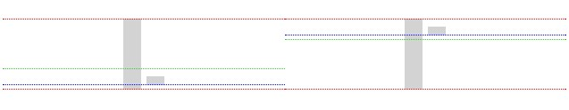

```html
<style type="text/css">
.tall-box,
.short-box { display: inline-block; /* size, color... */ }

.text-bottom { vertical-align: text-bottom; }
.text-top { vertical-align: text-top; }
</style>

<!-- left mark-up -->
<span class="tall-box text-bottom"></span>
<span class="short-box"></span>

<!-- right mark-up -->
<span class="tall-box text-top"></span>
<span class="short-box"></span>
```

相同的行为表明，vertical-align的其他属性值与较高元素的对齐（TODO)

* 即使设置vertical-align为bottom（左图）和top（右图）也移动了基线。这很奇怪，因为和基线没有一点关系。

图-12


```html
<style type="text/css">
.tall-box,
.short-box { display: inline-block; /* size, color... */ }

.bottom { vertical-align: bottom; }
.top { vertical-align: top; }
</style>

<!-- left mark-up -->
<span class="tall-box bottom"></span>
<span class="short-box"></span>

<!-- right mark-up -->
<span class="tall-box top"></span>
<span class="short-box"></span>
```

* 在一行放两个大的元素，并且垂直对齐它们，移动基线到满足两者对齐的位置。然后行盒子高度自适应（左图）。加第三个元素，在不超出行盒子边界情况对齐，既不影响行盒子高度也不影响基线位置（中间图）。如果让它超出行盒子边界，行盒子高度和基线也会随之调整。在如下图中，前两个盒子被往下推（右图）。

图-13

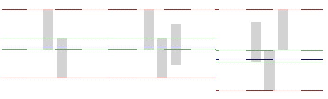

```html
<!-- left mark-up -->
<span class="tall-box text-bottom"></span>
<span class="tall-box text-top"></span>

<!-- middle mark-up -->
<span class="tall-box text-bottom"></span>
<span class="tall-box text-top"></span>
<span class="tall-box middle"></span>

<!-- right mark-up -->
<span class="tall-box text-bottom"></span>
<span class="tall-box text-top"></span>
<span class="tall-box text-100up"></span>

<style type="text/css">
  .tall-box    { display: inline-block;
                 /* size, color, etc. */ }

  .middle      { vertical-align: middle; }
  .text-top    { vertical-align: text-top; }
  .text-bottom { vertical-align: text-bottom; }
  .text-100up  { vertical-align: 100%; }
</style>
```

### Inline元素下方的小缺口

看下图，在用vertical-align对齐列表元素种`li`时很常见

图-14

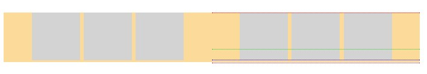

```html
<ul>
  <li class="box"></li>
  <li class="box"></li>
  <li class="box"></li>
</ul>

<style type="text/css">
  .box { display: inline-block;
         /* size, color, etc. */ }
</style>
```

可以看到，列表项“坐”在基线上。基线下面是盛放文字上升部的空间。这造成了这些缺口。解决方法就是，直接移开基线，比如这样对齐列表项`vertical-align: middle`：

图-15

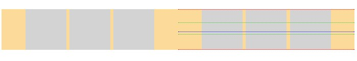


```html
<ul>
  <li class="box middle"></li>
  <li class="box middle"></li>
  <li class="box middle"></li>
</ul>

<style type="text/css">
  .box    { display: inline-block;
            /* size, color, etc. */ }

  .middle { vertical-align: middle; }
</style>
```

这个场景在inline-block元素有文字内容时不会有，因为内容已经让基线上移。

###　Inline之间的缺口破坏了布局

> 这主要是inline元素自己的问题．但是因为它们作为vertical-align作用的对象，还是有必要了解已下．

可以看到之前的例子里，列表项之间的缺口。这个缺口来自inline元素代码之间的空格。所有inline元素之间的空格会被合成一个。这些空格挡着路，如果我们给两个相邻inline元素设置`width: 50%`，那么没有两个50%和一个空格会超出一行，破坏了所希望的布局（左图）。为了移除这个缺口，我们需要删除代码里空格，比如将空格替换为HTML注释（右图）。

图-16

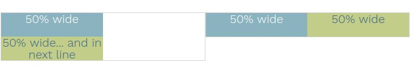

## 解密Vertical-Align

耶，就这些。一旦你了解规则这些并不复杂，如果vertical-align不正常工作，就想两个问题：

* 行盒子的基线和上下边界在哪里？
* inline元素的基线和上下边界在哪里？

它们会指引你找到问题的答案。


